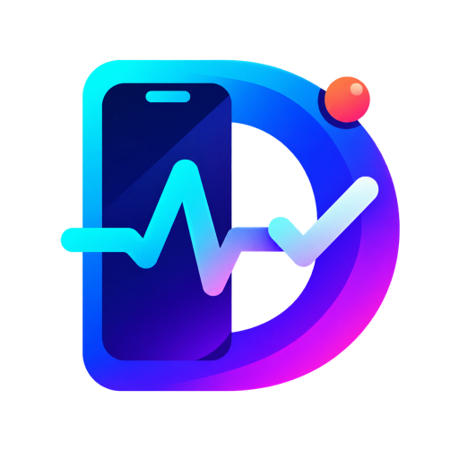
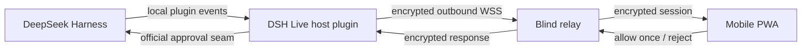

<div align="center">
  

# DSH Live

### Your agent calls. You decide.

**Approve sensitive actions, follow live progress, send photos, and review results from your phone — without staying at your desk.**

[](#project-status)
[](https://github.com/deepseek-ai/deepseek-harness)
[](#platform-support)
[](#platform-support)
[](LICENSE)

[Why DSH Live?](#why-dsh-live) · [First release](#the-first-release) · [Installation](#installation) · [Security](#security-model) · [Roadmap](#roadmap)

</div>

> [!IMPORTANT]
> **DSH Live is currently a source-installable pre-alpha.** The minimum encrypted phone-approval loop is implemented, but no public production relay or signed `v0.1.0` release exists yet. Use the development installation only with a relay you control.

## Stop babysitting your coding agent

Long-running agents should give you time back. Instead, one approval request can leave an agent waiting while you are making coffee, commuting, or reviewing something away from your computer.

DSH Live turns that dead time into a simple mobile loop:

```text
Agent needs you  →  Your phone alerts you  →  You inspect and decide
        ↑                                             ↓
        └──────── Agent continues and reports back ───┘
```

It is not a remote terminal and it is not a miniature IDE. It is the focused control surface an agent needs when your attention matters.

## Why DSH Live?

### One inbox for decisions

See what the agent wants to do, why approval is required, and the relevant tool context. **Allow once** or **reject** from your phone. Approval remains fail-closed: no connection, malformed response, or expired request can silently grant access.

### A live pulse, not a wall of logs

Know whether the agent is running, waiting for approval, completed, failed, or cancelled. DSH Live summarizes activity for a glanceable phone view instead of trying to reproduce the desktop interface.

### Show the agent what you mean

Take a photo or choose an image and send it as a native DeepSeek Harness attachment. Use cases include UI bugs, device screenshots, handwritten notes, hardware setups, and visual acceptance feedback.

### Review the outcome from anywhere

Receive the final summary, test status, and changed-file count. Accept the result as reviewed or send a concise follow-up. Acceptance records your review; it does **not** commit, push, deploy, or run another hidden action.

## The first release

Version `v0.1.0` is deliberately small. It will prove one high-value workflow end to end on both iPhone and Android.

| Capability | v0.1.0 behavior |
| --- | --- |
| Secure pairing | Scan a one-time QR code shown by the DSH plugin |
| Approval inbox | Inspect requests, **allow once**, or **reject** |
| Live activity | Running, waiting, completed, failed, and cancelled states |
| Mobile input | Send text or use the phone keyboard's built-in dictation |
| Camera and images | Capture or select an image and attach it to the agent conversation |
| Result review | Read the summary and test signal, then accept or request changes |
| Notifications | Best-effort PWA notifications with a real-time in-app fallback |

The first release will **not** include a terminal, code editor, multi-agent dashboard, Git operations, deployment buttons, rollback, custom speech recognition, or native App Store/Play Store apps. Keeping this boundary tight is a product and security decision.

## A typical moment

1. Start a DeepSeek Harness task on your computer.
2. Scan the DSH Live pairing QR code with your phone.
3. Walk away while the agent works.
4. Receive an approval request on your phone.
5. Hold **Allow once** to approve the exact action, or tap **Reject**.
6. Follow the task's live state and add a photo or dictated instruction if needed.
7. Review the final summary and mark the result accepted—or ask for another change.

## Installation

### Current status

There is no stable npm release today. A built checkout can be packed and installed into an isolated DSH Web profile for development and real-device testing. See the [complete relay, plugin configuration, and acceptance guide](docs/real-device-loop.md).

```bash
pnpm install
pnpm run check
pnpm run build
pnpm pack
dsh plugin --profile web add ./dsh-live-0.0.0.tgz
```

### Planned stable installation

After `v0.1.0` passes the release gates, the recommended path will be:

```bash
dsh plugin --profile web add dsh-live
dsh web
```

For a reproducible install pinned to a reviewed GitHub tag:

```bash
dsh plugin --profile web add github:zhoushuoshi-code/dsh-live#v0.1.0
dsh web
```

The release package will ship prebuilt JavaScript and a standard DSH bundle manifest. Users will not need Python, Rust, native compilation, or a repository build.

### Target requirements

- DeepSeek Harness `0.1.0-rc.7` (the first compatibility target)
- Node.js `^22.19.0` or `>=24.0.0`, matching DeepSeek Harness
- pnpm available on `PATH`, as required by `dsh plugin`
- A modern iPhone or Android browser with HTTPS support

Compatibility will be widened only after it is tested—not assumed.

## How it will work



The desktop plugin initiates the outbound connection, so the user does not expose a local port to the public internet. The relay transports encrypted envelopes and has no access to prompts, commands, images, results, pairing secrets, or API keys. It necessarily observes routing and traffic metadata. See the [versioned E2EE protocol and threat model](docs/e2ee-protocol.md).

DSH Live is being designed against DeepSeek Harness's official extension seams:

- [`approval/request`](https://github.com/deepseek-ai/deepseek-harness/blob/master/docs/subsystems/approval.md) for one-shot, fail-closed decisions
- [`ctx.attachments`](https://github.com/deepseek-ai/deepseek-harness/blob/master/docs/subsystems/attachment.md) for validated, durable image attachments
- Profile plugin bundles for installation into the `web` profile

No DOM scraping, UI monkey-patching, or dependency on private in-memory objects is planned.

### Approval bridge: verified

The first technical spike passed against DeepSeek Harness `0.1.0-rc.7`. DSH Live consumes the public `ctx.apiProxy` service as a second client; it does not register or steal an `approval/request` answerer. Desktop and mobile receive the same stable pending request, the first valid response wins, mobile disconnect leaves desktop approval live, and turn cancellation closes both views. See the [reproducible spike report](docs/approval-bridge-spike.md).

## Security model

Remote approval is a security boundary, not just a notification feature. The implementation and threat model must be reviewed before the first release.

Planned guarantees:

- **Allow once only.** The phone cannot create a permanent approval rule.
- **Fail closed.** Disconnects, timeouts, cancellation, invalid messages, and missing handlers never become approval.
- **First valid decision wins.** Desktop and mobile can race safely; an action executes at most once.
- **End-to-end encrypted payloads.** Pairing establishes session keys; the relay should only see routing metadata and ciphertext.
- **Replay resistance.** Every command carries a session identity, sequence number, expiry, and authenticated encryption tag.
- **No API keys on the phone.** DeepSeek credentials remain with the Harness host.
- **Desktop remains authoritative.** Losing the phone or relay must not disable local approval or task control.

These are release requirements, not claims that the current pre-alpha repository already satisfies them.

## Platform support

The first release will be tested against this explicit support matrix:

| Platform | Supported path | Notes |
| --- | --- | --- |
| iPhone | iOS 17+ · Safari · Add to Home Screen | Push behavior depends on installed PWA permissions |
| Android | Android 12+ · Chrome 120+ | Installable PWA with browser notification permissions |
| Desktop host | DeepSeek Harness Web profile | Initial target: DSH `0.1.0-rc.7` |
| Embedded browsers | Not supported | Open the pairing link in Safari or Chrome |

If notifications are unavailable, an open PWA must still receive live updates. If the phone is offline, desktop DeepSeek Harness must continue to work normally.

## Roadmap

- [x] Validate the mobile/desktop approval bridge without stealing desktop ownership
- [x] Scaffold the installable DSH profile bundle and commit prebuilt artifacts
- [x] Implement the QR pairing, E2EE session protocol, and blind-relay core
- [x] Implement the deployable WSS relay and connect the Host/mobile transport adapters
- [x] Build the minimum mobile approval inbox and encrypted decision state machine
- [ ] Deploy the public production relay and publish its operational status
- [ ] Add text, system dictation, and native image attachment flow
- [ ] Add final-result review and follow-up input
- [ ] Pass iPhone and Android real-device release gates
- [ ] Verify npm tarball and pinned GitHub-tag installation in clean environments
- [ ] Publish `v0.1.0`

Progress will be marked here only after the corresponding behavior is demonstrated and tested.

## Release gates for v0.1.0

A release is not ready because the interface looks finished. It is ready only when all of these behaviors pass:

1. Desktop and phone see the same pending approval.
2. A phone approval executes the requested tool no more than once.
3. A desktop decision resolves the phone card immediately.
4. Phone or relay disconnection never breaks desktop approval.
5. Turn cancellation withdraws the mobile request.
6. Photos arrive through the official attachment store with format and size validation.
7. A clean user can install the published package without building the repository.
8. The critical journey passes on a real supported iPhone and Android device.

## Contributing

DSH Live is being built in public. Early contributions are most valuable when they improve the approval bridge, protocol security, cross-platform PWA behavior, accessibility, or reproducible installation.

Before opening a large pull request, please start with an issue describing the user problem, security implications, and proposed acceptance test. Bug reports should include the DeepSeek Harness version, host OS, phone/browser version, reproduction steps, and expected versus actual behavior—without secrets or private prompts.

## Project status

**Pre-alpha / active development.** There is currently no stable release, hosted production relay, npm package, or compatibility guarantee. Watch the repository for the first installable preview.

DSH Live is an independent community project and is not affiliated with or endorsed by DeepSeek.

## License

[MIT](LICENSE) © 2026 DSH Live contributors
