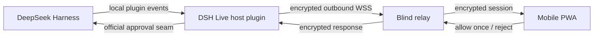

<div align="center">
  

# DSH Live

### Your agent calls. You decide.

**Approve or reject sensitive DeepSeek Harness actions from your phone without giving up desktop control.**

[](#project-status)
[](https://github.com/zhoushuoshi-code/dsh-live/actions/workflows/ci.yml)
[](https://github.com/deepseek-ai/deepseek-harness)
[](#platform-support)
[](#platform-support)
[](LICENSE)

[Why DSH Live?](#why-dsh-live) · [First release](#the-first-release) · [Installation](#installation) · [Security](#security-model) · [Roadmap](#roadmap)

</div>

> [!IMPORTANT]
> **DSH Live is a source-installable `v0.1.0` preview.** The encrypted phone-approval loop is implemented and maintainer-tested on iPhone and Android. There is no shared public Relay or npm release: deploy a Relay you control and pin installations to a reviewed Git commit or preview tag.

## Stop babysitting your coding agent

Long-running agents should give you time back. Instead, one approval request can leave an agent waiting while you are making coffee, commuting, or reviewing something away from your computer.

DSH Live turns that dead time into a simple mobile loop:

```text
Agent needs you  →  Your phone alerts you  →  You inspect and decide
        ↑                                             ↓
        └──────── Agent continues and reports back ───┘
```

It is not a remote terminal and it is not a miniature IDE. It is the focused control surface an agent needs when your attention matters.

## Why DSH Live?

### One inbox for decisions

See what the agent wants to do, why approval is required, and the relevant tool context. **Allow once** or **reject** from your phone. Approval remains fail-closed: no connection, malformed response, or expired request can silently grant access.

### Desktop authority stays intact

DSH Live mirrors the official pending approval registry instead of registering a competing approval handler. Desktop and phone can race safely, the first valid decision wins, and a phone or Relay disconnect never grants access or disables desktop approval.

### The Relay carries ciphertext

One-time QR pairing derives directional session keys. Tool names, reasons, and decisions cross the hosted Relay only inside authenticated AES-256-GCM envelopes. The Relay still observes connection metadata; DSH Live does not claim anonymity.

## The first release

Version `v0.1.0-preview.1` deliberately proves one high-value workflow end to end on iPhone and Android.

| Capability | `v0.1.0-preview.1` behavior |
| --- | --- |
| Secure pairing | Scan a one-time QR code shown by the DSH plugin |
| Approval inbox | Inspect requests, **allow once**, or **reject** |
| Desktop coexistence | Keep the official desktop approval live; first valid decision wins |
| End-to-end encryption | Keep approval payloads unreadable to the hosted Relay |
| Self-hosted PWA | Serve the phone UI and WSS Relay from one Docker deployment |
| Failure behavior | Disconnect, replay, tampering, and stale decisions fail closed |

The preview does **not** include background Push Notification, Live Activity, voice, photos, result review, a terminal, code editor, Git operations, or native App Store/Play Store apps. Keeping this boundary explicit is a product and security decision.

## A typical moment

1. Start a DeepSeek Harness task on your computer.
2. Scan the DSH Live pairing QR code with your phone.
3. Keep the paired PWA open while the agent works.
4. Inspect an approval request when it appears on the phone.
5. Hold **Allow once** to approve the exact action, or tap **Reject**.
6. Continue on desktop; either surface may resolve the next approval.

## Installation

### Current status

There is no stable npm release today. A built checkout can be packed and installed into an isolated DSH Web profile for development and real-device testing. Start with the [beginner Railway deployment guide](docs/deploy-railway.md), then use the [complete plugin configuration and real-device acceptance guide](docs/real-device-loop.md).

```bash
pnpm install
pnpm run check
pnpm run build
pnpm pack
dsh plugin --profile web add ./dsh-live-0.1.0-preview.1.tgz
```

### Pinned GitHub preview

A reproducible source install can be pinned to the preview tag:

```bash
dsh plugin --profile web add github:zhoushuoshi-code/dsh-live#v0.1.0-preview.1
dsh web
```

The repository commits prebuilt JavaScript and a standard DSH bundle manifest. The CI workflow also produces an installable tarball artifact. An npm release remains a later, separately verified distribution step.

### Target requirements

- DeepSeek Harness `0.1.0-rc.7` (the first compatibility target)
- Node.js `^22.19.0` or `>=24.0.0`, matching DeepSeek Harness
- pnpm available on `PATH`, as required by `dsh plugin`
- A modern iPhone or Android browser with HTTPS support

Compatibility will be widened only after it is tested—not assumed.

## How it works



The desktop plugin initiates the outbound connection, so the user does not expose a local port to the public internet. The relay transports encrypted envelopes and has no access to prompts, commands, images, results, pairing secrets, or API keys. It necessarily observes routing and traffic metadata. See the [versioned E2EE protocol and threat model](docs/e2ee-protocol.md).

DSH Live uses DeepSeek Harness's official extension seams:

- [`approval/request`](https://github.com/deepseek-ai/deepseek-harness/blob/master/docs/subsystems/approval.md) for one-shot, fail-closed decisions
- Profile plugin bundles for installation into the `web` profile

No DOM scraping, UI monkey-patching, or dependency on private in-memory objects is planned.

### Approval bridge: verified

The first technical spike passed against DeepSeek Harness `0.1.0-rc.7`. DSH Live consumes the public `ctx.apiProxy` service as a second client; it does not register or steal an `approval/request` answerer. Desktop and mobile receive the same stable pending request, the first valid response wins, mobile disconnect leaves desktop approval live, and turn cancellation closes both views. See the [reproducible spike report](docs/approval-bridge-spike.md).

## Security model

Remote approval is a security boundary, not just a notification feature. The preview implements and tests these guarantees:

Implemented guarantees:

- **Allow once only.** The phone cannot create a permanent approval rule.
- **Fail closed.** Disconnects, timeouts, cancellation, invalid messages, and missing handlers never become approval.
- **First valid decision wins.** Desktop and mobile can race safely; an action executes at most once.
- **End-to-end encrypted payloads.** Pairing establishes session keys; the relay should only see routing metadata and ciphertext.
- **Replay resistance.** Every command carries a session identity, sequence number, expiry, and authenticated encryption tag.
- **No API keys on the phone.** DeepSeek credentials remain with the Harness host.
- **Desktop remains authoritative.** Losing the phone or relay must not disable local approval or task control.

See [SECURITY.md](SECURITY.md) for private vulnerability reporting and [the protocol document](docs/e2ee-protocol.md) for the exact metadata boundary.

## Platform support

The maintainer reports completing the approval journey on both phone families. Exact device/browser versions should still be included in bug reports:

| Platform | Supported path | Notes |
| --- | --- | --- |
| iPhone | Current Safari · direct QR link | Keep the PWA foregrounded; no background Push yet |
| Android | Current Chrome · direct QR link | Keep the PWA foregrounded; no background Push yet |
| Desktop host | DeepSeek Harness Web profile | Initial target: DSH `0.1.0-rc.7` |
| Embedded browsers | Not supported | Open the pairing link in Safari or Chrome |

If notifications are unavailable, an open PWA must still receive live updates. If the phone is offline, desktop DeepSeek Harness must continue to work normally.

## Roadmap

- [x] Validate the mobile/desktop approval bridge without stealing desktop ownership
- [x] Scaffold the installable DSH profile bundle and commit prebuilt artifacts
- [x] Implement the QR pairing, E2EE session protocol, and blind-relay core
- [x] Implement the deployable WSS relay and connect the Host/mobile transport adapters
- [x] Build the minimum mobile approval inbox and encrypted decision state machine
- [x] Add Relay Ping/Pong heartbeat and GitHub CI release checks
- [x] Complete maintainer-reported iPhone and Android real-device approval runs
- [ ] Publish and operate a shared production Relay with a status page
- [ ] Add text, system dictation, and native image attachment flow
- [ ] Add final-result review and follow-up input
- [ ] Add background Push Notification and platform Live Activity surfaces
- [ ] Publish and verify an npm package in a clean environment
- [ ] Promote the preview to stable `v0.1.0`

Progress will be marked here only after the corresponding behavior is demonstrated and tested.

## Release gates for the approval preview

A release is not ready because the interface looks finished. It is ready only when all of these behaviors pass:

1. Desktop and phone see the same pending approval.
2. A phone approval executes the requested tool no more than once.
3. A desktop decision resolves the phone card immediately.
4. Phone or relay disconnection never breaks desktop approval.
5. Turn cancellation withdraws the mobile request.
6. The installable tarball contains the plugin, PWA, Relay, and deployment docs.
7. The critical journey passes on a real iPhone and Android device.

## Contributing

DSH Live is being built in public. Early contributions are most valuable when they improve the approval bridge, protocol security, cross-platform PWA behavior, accessibility, or reproducible installation. See [CONTRIBUTING.md](CONTRIBUTING.md) and [SECURITY.md](SECURITY.md).

Before opening a large pull request, please start with an issue describing the user problem, security implications, and proposed acceptance test. Bug reports should include the DeepSeek Harness version, host OS, phone/browser version, reproduction steps, and expected versus actual behavior—without secrets or private prompts.

## Project status

**`v0.1.0` Preview / active development.** The self-hosted encrypted approval loop is implemented and source-installable. There is no shared hosted Relay, npm release, background Push, or compatibility guarantee beyond the documented DSH target.

DSH Live is an independent community project and is not affiliated with or endorsed by DeepSeek.

## License

[MIT](LICENSE) © 2026 DSH Live contributors
